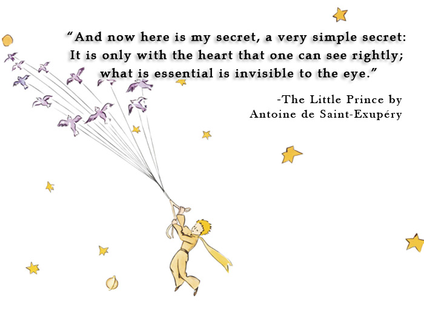

# User Manual

    

This is a guide to Dolfo's work-life style; a very quick tour of my personality and quirks.

Thank you for taking the time to read my user manual. The purpose of this guide is to help you understand my work style, personality, and preferences so that we can collaborate more effectively and enjoyably.

**About Me:** Software Engineering Leader with 15+ years of experience building cloud-native platforms. CKA and CKS certified. Former Engineering Manager at VMware Tanzu, where I led teams building Eventing Runtime, Function Buildpacks, and DORA metrics systems. Currently learning AI Agentic flows using LangChain and LangGraph.

## Conditions I like to work in

- I am most productive in the morning when there are fewer interruptions.
- I prefer to have my coffee before checking any messages, issues, or pull requests.
- I find pairing with colleagues to be a highly effective way of working, especially for complex tasks. However, if the task involves learning, I prefer to work independently.
- To recharge, I like to take a walk outside and/or grab an extra coffee.

## Times/Hours I like to Work

- I work in the Central Time timezone and usually start my workday between 7:30 AM to 8:00 AM.
- I take long breaks during the day and generally finish work around 5:00 PM to 6:00 PM.

## Best ways to communicate with me

- I use Slack to keep in touch with my team, colleagues, and friends. You can find me on Kubernetes, Cloud Foundry, or Knative Slack by mentioning @dolfo.
- You can reach me via email at me@dolfo.codes.
- Follow my blog at [dolfo.codes](https://dolfo.codes) for thoughts on software engineering, team leadership, and event-driven architectures.
- Connect with me on [LinkedIn](https://linkedin.com/in/dolfolife) or [GitHub](https://github.com/dolfolife).

## How I best receive feedback

- I appreciate specific and actionable feedback that helps me improve my work.
- I prefer written feedback followed by a conversation, especially if there are any topics that I might not fully understand.

I get excited when I get feedback that helps me improve my work. It is a sign of a healthy team.

## Leadership Style

- I strive to be a servant leader who helps team members grow and learn.
- I work hard to ensure that teams are aligned on the same goals and working towards a common direction.
- I believe that the mental health of the team is of utmost importance, and I focus on building a cohesive team where members trust and support each other.
- Throughout my career managing teams of 10+ engineers, I've implemented practices like blameless postmortems, coached technical leads, and driven organizational change that scales.

## How I learn best

- I like to understand the `why` of the software and then I can understand the `how` of the software.

## Things I struggle with

- I find myself more often than not doing more things than I can handle at a time making me feel like I am not productive. I need to keep a prioritized list of things I need to do and make sure the list does not grow too much.

## Things I read

- In terms of software engineering, I am interested in learning about patterns, problem-solving approaches, and ways of thinking that other programmers have used in the past.
- Currently diving deep into AI Agentic flows, LangChain, and LangGraph to understand how to build intelligent, autonomous systems that can reason and take action.
- I am focused on team cohesion, coaching, mentoring, and leading teams in various projects. I also read books on leadership, management, and organizational behavior.
- Outside of work, I enjoy reading about personal development, psychology, science, and cooking.

You can find some of my recommendations on my [Bookshelf](../BOOKSHELF.md).

## Other things to know about me

I secretly love TypeScript and its functional programming aspect. I use it in every interview or hack that is too complex to be done in bash.

## If I am not working, I am...

### Spending time with my family

I love spending time with my family. I have a wife and one kid. I love to play with my kid and watch them grow. I also love to travel with my family and learn about new cultures with them.

### Cooking

I love making bread, and other baking goods. I often take a week off work at home just cooking when I need to recharge my batteries. I love cooking because it is like coding, and you can construct amazing things with the right parameters.

### Staring at the ocean

There is nothing that will calm me down more than the ocean views. Open fields bring deep thoughts and appreciation for my environment, and the ocean is the best at it.

### Running

One activity that helps me think better is running. I try to run every day but some days I am too lazy for this important task. It helps my concentration and thought process.

## If I were an animated Gif/meme/animal/song, I would be

    

## FAVORITE QUOTE

    

## Thank you
